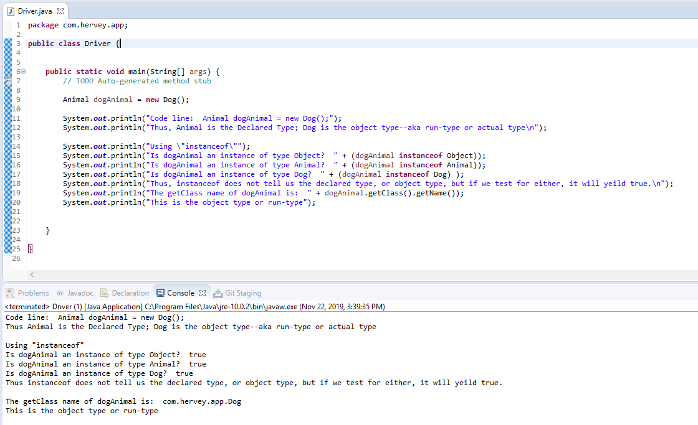

# classSubclassDemo

A simple project that provides a demonstration and reference for Declared Type/Object Type aka run-type aka actual type as well as getClass method and instanceof operator

# Selected Screenshots:
Below shows code as well as output

# Potential Future Features:
None planned, but could add other functionality to support future blogs related to inheritance or interface implementations

